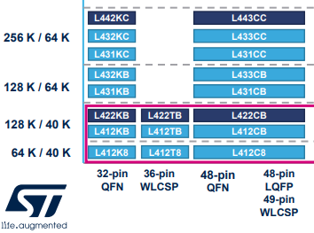

### Devboard Idea: Bill Of Materials

BOM:
* 1 x MCU (STM32L4, 80MHz, 256kB flash, 64 kB RAM)
* 1 x Xtal (8 MHz? 32kHz? check Nucleo32 L4)
* 1 x NeoPixel APA102 (SPI)
* 1 x LED (power/uploading/general LED)
* 2 x button switch
* 1 x USB Type-C (or B, as it has a smaller connector?)
* 1 x voltage regulator
* 1 x serial-to-USB CP2104 [optional?]
* 1 x I2S microphone (Knowles SPH0645LM4H)
* ~~1 x IMU sensor (LSM9DS1)~~
* 1 x accelerometer/magnetometer LSM303DLHC
* 1 x gyroscope L3GD20
* 1 x temp/hum sensor (ST HTS221) [optional]
* 1 x pressure sensor (ST LP221) [optional]
* 1 x Flash memory (2MB QSPI) [optional]

